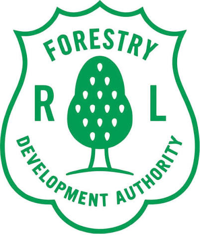

# Forestry Development Authority (FDA) — Republic of Liberia
## Integrated Management Information System (MIS / ERP)
### Human Resource, Financial Management, Public Procurement & Asset Control Platform

<div align="center">
  
  <p><strong>Forestry Development Authority • Republic of Liberia</strong><br />
  Whein Town, Bernard Farm, Montserrado County, Liberia<br />
  <em>Established under the Act Creating the Forestry Development Authority of 1976 and the National Forestry Reform Law of 2006</em></p>
  <p>
    <a href="https://totagits.github.io/fda-integrated-management-system/" target="_blank">
      <strong>🔗 Live Online Platform & Interactive Demo: https://totagits.github.io/fda-integrated-management-system/</strong>
    </a>
  </p>
</div>

---

## 🌲 Overview

This enterprise digital platform serves as the authoritative Management Information System (MIS / ERP) for the **Forestry Development Authority (FDA)** of the Republic of Liberia. Built in direct response to the **Request for Expressions of Interest (REOI)** and **Terms of Reference (TOR)** for **"Integrated System Development (HR, Financial, Procurement & Asset Management System)"**, it replaces fragmented paper systems with unified, auditable, and automated digital workflows across FDA Headquarters and field operations across all 15 Liberia counties.

---

## 🏛️ Statutory Mandate & Legal Framework

The platform is designed strictly within the statutory mandate of Liberia's forest sector governance:
- **Act Creating the Forestry Development Authority (1976)**
- **National Forestry Reform Law (2006)**
- **Public Financial Management (PFM) Act of 2009**
- **Public Procurement and Concessions Commission (PPCC) Act**
- **Decentralization Policy & Civil Service Agency (CSA) Regulations**

---

## 🧩 Core Architectural Pillars

### 1. 👥 Human Resource Management (HRMIS) & Dual-Currency Payroll
- **Personnel Registry:** Detailed profiles for Civil Service Cadre, FDA Permanent Staff, and Field Rangers across 15 counties.
- **Biometric & CSA Boundary:** Mapped to Civil Service Agency (CSA) biometric IDs and civil-service grade bands.
- **Leave & Compensatory Field Rest Workflow:** Multi-tier approvals for routine leave and extended forest patrol rest.
- **Dual-Currency Payroll (USD & LRD):** Automated calculations for base salary, 20% LRA Personal Income Tax withholding, and 4% NASSCORP social security pension deductions, with official pay advice generation.

### 2. 💰 Financial Management & Vote Book Budgetary Controls
- **GoL Chart of Accounts:** Standardized general ledger accounts in both USD and LRD.
- **Hard Budget Ceiling Controls:** Real-time vote book monitoring that blocks expenditure commitments exceeding departmental allotments.
- **Maker-Checker Payment Vouchers:** 3-tier digital authorization chain: Requisitioner → Internal Audit Review → Finance Director Verification → Managing Director (*Hon. Rudolph J. Merab, Sr.*) Executive Authorization.
- **National Treasury & Bank Accounts:** Operational accounts linked to the Central Bank of Liberia (CBL), LBDI, and commercial banks.
- **IFMIS Integration Gateway:** Standardized commitment batch generator interfacing with the Ministry of Finance and Development Planning (MFDP).

### 3. 🛒 Public Procurement & PPCC / e-GP Compliance
- **Annual Procurement Plan (APP):** Automated classification by statutory threshold (RFQ up to \$10k, Restricted Tendering, NCB up to \$200k, ICB).
- **Certified Vendor Registry:** Verified against Liberia Business Registry (LBR) registration, Liberia Revenue Authority (LRA) Tax Clearance certificates, and PPCC registration IDs.
- **3-Way Matching Engine:** Audit reconciliation cross-matching Purchase Requisition (PR) ↔ Approved Purchase Order (PO) ↔ Central Store Goods Received Note (GRN) ↔ Supplier Invoice before voucher release.

### 4. 📦 Fixed Asset Register, Barcode Tagging & Depreciation
- **Fixed Asset Register:** Real-time tracking of patrol vehicles (Toyota Land Cruisers/Hilux), ranger motorbikes, Garmin satellite communicators, solar power arrays, and IT infrastructure.
- **Interactive QR & Barcode Generator:** Visual, printable asset tags featuring the official FDA seal, serial numbers, and equipment codes.
- **Automated Straight-Line Depreciation:** Dynamic calculation of useful life, salvage value, accumulated depreciation, and net book value.
- **County Depot Waybills:** Inter-depot custody transfer workflows between Whein Town HQ and regional stations.
- **Consumable Stores:** Tracking for ranger field uniforms, fuel coupons, and patrol rations.

### 5. 🛰️ Decentralized Field-to-HQ Forestry Operations
- **15-County Synchronization Hub:** Offline-first architecture allowing remote forest outposts (Sapo National Park, East Nimba Nature Reserve, Gola Rainforest) to record field logs and sync when satellite (Starlink) or cellular connectivity is present.
- **Timber Concession Permitting:** Registry of Forest Management Contracts (FMC), Timber Sale Contracts (TSC), and Community Forests (CFMA) cross-referenced with **SGS LiberTrace Chain of Custody (CoC)**.
- **Ranger Incident & Seizure Logging:** Real-time field reporting of illegal pit-sawing, chainsaw confiscations, and wildlife protection with direct escalation to the Managing Director.

### 6. 🛡️ Governance, Security & Immutable Audit Trail
- **Requirements Traceability Matrix (RTM):** Interactive dashboard directly linking every clause in the REOI & TOR to active system features and test cases.
- **Segregation of Duties (SoD) Switcher:** Persona testing under Managing Director, Finance Director, HR Director, Procurement Officer, Asset Officer, Field Ranger, and Internal Auditor.
- **Cryptographic Audit Trail:** SHA-256 hash chaining on all transactions ensuring non-repudiation and forensic auditability.
- **CISSP / NIST Posture:** Triple-redundancy database backup schedules, RTO < 2 hours, and RPO < 15 minutes.

---

## 📋 Requirements Traceability Matrix (RTM) Summary

| Requirement ID | REOI / TOR Section | Category | Description | Status |
| :--- | :--- | :--- | :--- | :--- |
| **REQ-TOR-01** | REOI §1 & TOR §1 | Governance | Statutory alignment under 1976 Act & 2006 Reform Law | **Compliant** |
| **REQ-TOR-02** | REOI §3 & TOR §2 | Integration | GoL IFMIS Integration Gateway (MFDP) | **Compliant** |
| **REQ-TOR-03** | REOI §3 & TOR §2 | Integration | CSA HRMIS & Biometric Cadre Boundary | **Compliant** |
| **REQ-TOR-04** | REOI §3 & TOR §2 | Integration | PPCC e-GP Public Procurement Compliance | **Compliant** |
| **REQ-TOR-05** | REOI §3 & TOR §2 | Integration | SGS LiberTrace Timber Legality & Chain of Custody | **Compliant** |
| **REQ-TOR-06** | REOI §2 & TOR §1 | Finance | Hard Vote Book Budget Ceiling Controls | **Compliant** |
| **REQ-TOR-07** | TOR §6 (Methodology)| Finance | Multi-Tier Payment Voucher Authorization (MD Sign-Off)| **Compliant** |
| **REQ-TOR-08** | REOI §2 & TOR §6 | HR & Payroll | Dual-Currency (USD/LRD) Payroll & LRA/NASSCORP Taxes | **Compliant** |
| **REQ-TOR-09** | TOR §6 (Methodology)| Procurement | Automated 4-Pillar 3-Way Matching Engine | **Compliant** |
| **REQ-TOR-10** | TOR §6 (Methodology)| Assets | Fixed Asset Register with QR Tagging & Depreciation | **Compliant** |
| **REQ-TOR-11** | REOI §2 & TOR §8 | Operations | Field-to-HQ Decentralized Sync across 15 Counties | **Compliant** |
| **REQ-TOR-12** | REOI §4 & TOR §7 | Security | Cryptographic Immutable Audit Trail & SoD Enforcement | **Compliant** |

---

## 🚀 Quickstart & Local Development

### Prerequisites
- Node.js (v18+)
- npm (v9+)

### Installation
```bash
# Clone the repository
git clone https://github.com/totagits/fda-integrated-management-system.git
cd fda-integrated-management-system

# Install dependencies
npm install

# Run unit & workflow test suite
npm test

# Start local development server
npm run dev
```

### Production Build
```bash
# Compile TypeScript and bundle production assets
npm run build

# Preview production build locally
npm run preview
```

---

## 🏛️ Executive Leadership & Contacts

**Forestry Development Authority (FDA)**  
Whein Town, Bernard Farm, Montserrado County, Liberia  

- **Hon. Rudolph J. Merab, Sr.** — Managing Director & Chief Executive Officer
- **Primary Contact:** `v.kpaiseh@yahoo.com`
- **Clarification:** `wynnbryant12@gmail.com`
- **Telephone:** 0776-063-643 / 0886-551-249

---
*Developed for the Forestry Development Authority, Republic of Liberia.*
